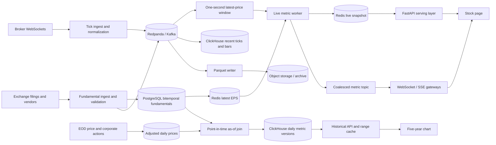

# Multi-Frequency Financial Data Platform

## Goals and design principles

The platform serves more than 5,000 NSE/BSE symbols at four frequencies: live ticks, daily
adjusted prices, quarterly results, and annual statements. The central requirement is not
merely speed; it is reproducibility. A value shown for 10 February 2022 must use only facts
publicly known by that time. The design therefore separates immutable source events from
current snapshots, gives every fundamental a publication timeline, and uses materialized
daily metrics for historical reads. Second-level live latency allows useful coalescing rather
than an expensive calculation for every tick.

## Q1 — Storage: four frequencies, one system

Normalized events enter **Redpanda (Kafka-compatible)**. It provides partition ordering,
consumer replay, back-pressure, and independent consumers for live serving, storage, and
quality checks. Tick topics are partitioned by exchange and symbol hash; fundamental topics
use company/security ID as the key. A schema registry enforces event compatibility.

Recent raw ticks and aggregate bars live in **ClickHouse**. Its columnar compression,
partition pruning, merge-tree engines, and aggregate materialized views fit append-heavy
time-series analytics better than PostgreSQL. Tables partition by trading month, order by
`(instrument_id, event_time)`, and retain exchange timestamp, receive timestamp, sequence,
price, quantity, and source. Instrument identity is an internal immutable ID, not a ticker:
tickers can change and one security may trade on both exchanges.

**PostgreSQL** stores the security master, corporate actions, trading calendars, source
lineage, and versioned fundamentals. These datasets need constraints, transactions, and
relational joins more than extreme ingest throughput. **Redis Cluster** stores only current
snapshots—latest price, latest eligible EPS, and current derived metrics—with short TTLs; it
is never the source of truth. **S3-compatible object storage** holds immutable raw captures
and Parquet history for cheap replay and disaster recovery.

Point-in-time fundamentals use two time axes. Each record contains `period_end` (the business
period described), `published_at` (exchange-publication time), `ingested_at` (our observation
time), `effective_from`, `effective_to`, `revision`, source document hash, and metric value.
A unique version is appended; updates never overwrite prior facts. If Q3 EPS is released at
19:00 Tuesday, it cannot affect Tuesday's 15:30 close or any earlier timestamp. An as-of query
at time `T` selects the latest version with `published_at <= T` (and, for operational replay,
optionally `ingested_at <= replay_cutoff`). A Thursday restatement creates another row with a
new `published_at`; it does not rewrite what Wednesday's users could know. This bitemporal
shape distinguishes economic validity from system knowledge and permits exact incident
reconstruction.

Raw ticks grow too quickly for permanent hot storage. Keep 30 days of ticks in ClickHouse,
one-second OHLCV bars for 12 months, one-minute OHLCV for seven years, and adjusted daily
OHLCV indefinitely. Stream every raw event into date/hour-partitioned, Zstandard-compressed
Parquet in object storage, clustered by instrument ID. Lifecycle old raw objects into colder
tiers after 90 days and deep archive after one year. Aggregate jobs reconcile volume and
OHLC invariants before hot raw partitions expire. Object storage remains replayable, but the
normal historical API never scans it.

## Q2 — Compute engine and derived metrics

A hybrid strategy matches the two update triggers. A Kafka Streams/Flink-style worker keeps
the newest tick per symbol in a one-second window. Once per second it joins that price with
the current point-in-time fundamental snapshot, computes P/E, yield, and lightweight momentum,
then writes Redis and publishes a UI update. Coalescing roughly 300 ms ticks into one-second
updates cuts calculation and fan-out load while meeting the stated latency. It also limits
work to symbols with active subscribers or changed inputs.

A fundamental event is rarer but has broad impact. Its consumer validates units, fiscal
period, duplicates, and monotonic publication time, appends the PostgreSQL version, refreshes
the symbol's Redis fundamental snapshot, and emits `fundamental.changed`. That event
immediately recomputes the current metric even if no new tick arrives. Thus both price and
EPS changes trigger a live result. Expensive cross-sectional factors run on schedule after
market close because their universe-wide ranks are not meaningfully tick-level.

Historical metrics are compute-on-schedule and correction-on-write. After adjusted EOD prices
arrive, a batch performs an as-of join between every daily close and the fundamental version
known at that close, then stores a daily metric row in ClickHouse. The key includes
`instrument_id`, date, and `methodology_version`. Corporate-action adjustments, late source
data, or restatements emit bounded recomputation jobs for affected instruments/date ranges.
Methodology versions make research reproducible when definitions change. Compute-on-read is
reserved for unusual exploratory queries; it is too unpredictable for the primary chart API.

P/E also needs financial rules: non-positive EPS should produce `null` plus a reason rather
than a misleading negative/massive ratio; TTM EPS must combine the correct four fiscal
quarters; prices and per-share values must share corporate-action adjustment bases; and each
result carries price/fundamental timestamps and source version IDs.

## Q3 — APIs, serving, and caching

For a stock page, `GET /v1/instruments/{id}/snapshot` performs a Redis multi-get for the latest
price and metrics, normally avoiding a database round trip and comfortably meeting 200 ms.
The response includes `as_of`, staleness, market status, and input version IDs. WebSocket or
Server-Sent Events then subscribe by instrument ID. The gateway consumes coalesced metric
events and sends only changed fields. Thousands of clients do not create thousands of Kafka
consumers: stateless gateways share subscriptions and fan out locally. If Redis misses, the
API reads the latest ClickHouse/PostgreSQL values, rebuilds the cache, and marks stale results.

Tick updates replace only `live:{instrument}` and publish invalidation; TTL is a safety net,
not the consistency mechanism. A new EPS invalidates that instrument's fundamental and live
metric keys. Event version/sequence checks prevent delayed consumers from overwriting newer
values. During market hours live keys may expire after 30 seconds; closed-market snapshots
have longer TTLs and an explicit market-closed flag.

For `GET /v1/instruments/{id}/metrics/pe?from=&to=&frequency=1d`, the API queries precomputed
ClickHouse daily rows and returns about 750 points for three years. CDN/Redis caches use a key
containing instrument, range, frequency, adjustment version, and methodology version. Old
completed ranges can be cached for a day; ranges containing the latest session use minutes.
Correction events purge only overlapping symbol/range keys, or naturally miss because a data
version changed. Responses support ETags and compact arrays/Arrow where appropriate. Limits
on range and resolution prevent accidental raw-tick scans; large research exports become
asynchronous object-storage jobs.

## Q4 — Full picture

A live P/E follows WebSocket tick → normalized Kafka event → one-second latest-price window →
join with Redis's most recently published TTM EPS → calculation → Redis snapshot and metric
topic → API/gateway → UI. A five-year chart follows immutable EOD/corporate-action ingestion →
adjusted daily price → as-of join against the fundamental publication timeline → versioned
daily metric table → cached historical API. Both paths retain input version IDs, so an on-call
engineer or researcher can explain exactly why a number appeared.

Operationally, lag, event-time skew, rejected fundamentals, stale-symbol counts, cache hit
rate, compute duration, and API percentiles are monitored per pipeline. Dead-letter events
retain payload and validation reason. Multi-availability-zone Kafka, replicated PostgreSQL,
ClickHouse backups, and immutable object storage cover failures; replay from Kafka or Parquet
rebuilds derived state. This stack uses specialized components only where their trade-offs
matter: PostgreSQL for correctness, ClickHouse for scans, Redis for bounded latest-state
latency, and object storage for economical retention.
